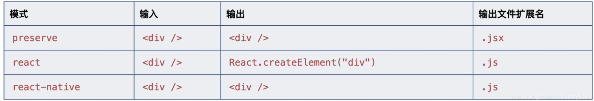
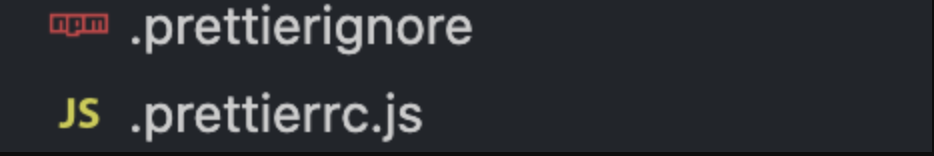

# 前言
现在写这篇文章的时候，React的版本已经是`17.x`，Typescript也已经是`4.x`，webpack也已经到了`5.x`。而我们组的业务一直都很忙，所以我们的项目模版还是React`16.x`（不支持Hook特性），也`没有支持TS`，并且`webpack`也才`3.x`， 还是几年前的配置，这项目配置就像是一艘行驶在大海中的破船，一不小心就会被一个海浪打的散架，果然越担心什么就发生了什么，突然我们打包的时候，惊奇的发现一个打包的插件失效了，导致我们打包📦一直失败的，最后是换了一个插件才解决了这个问题，不过这就像是一艘破船，不知道什么地方还会问题。

是的，说了这么大一堆就是我这个渔夫想换船🚢了。谁不想上线的时候没有问题呢。

# 搭建TS+React的开发环境
`planA`: 最快捷的方式莫过于直接用`create-react-app`:

```javascript
npx create-react-app my-app --template typescript
```
不过好像这样的话有点索然无味了，那我们就用`planB`，手把手搭建这个项目:

## 安装React及TS
1.安装相关库
```javascript
npm i react react-dom react-redux typescript --save
```
2.安装@types声明库

```javascript
npm i @types/react @types/react-dom @types/react-redux --save-dev
```
安装完后我这边的包的版本情况如下：
- `react` 17.0.1
- `react-dom` 17.0.1
- `react-redux` 7.2.3
- `typescript` 4.1.3

## 创建tsconfig.json
`tsconfig.json`文件可以理解为存放编译`TS`的配置文件，这边我粘贴一下自己的配置：

```javascript
{
  "compilerOptions": {
    "target": "es5",  // 编译的目标
    "allowJs": true,
    "skipLibCheck": true,
    "esModuleInterop": true,
    "allowSyntheticDefaultImports": true,
    "strict": true,
    "forceConsistentCasingInFileNames": true,
    "noFallthroughCasesInSwitch": true,
    "noUnusedLocals": false,
    "noUnusedParameters": false,
    "module": "esnext",
    "moduleResolution": "node",
    "resolveJsonModule": true,
    "isolatedModules": true,
    "noEmit": false,
    "jsx": "preserve",
    "baseUrl": "./",
    "paths": {
      "@": ["src/"]
    }
  },
  "include": ["./src/**/*"]
}
```
### tsconfig部分配置解析
`baseUrl`:`TS编译器`需要编译模块的地址
`paths`:基于`baseUrl`的路径，指定模块和路径的映射关系

```javascript
import a from '../../src/a.ts';
等价于
import a from '@/a.ts';
```
`include`: 需要编译的目标文件夹
`jsx`: 这个配置是在`tsx`中支持`jsx`，可选参数`preserve`，`react`和`react-native`。 这些模式只在代码生成阶段起作用 - 类型检查并不受影响。 在`preserve`模式下生成代码中会保留`JSX`以供后续的转换操作使用（比如：`Babel`）。 另外，输出文件会带有`.jsx`扩展名。` react`模式会生成`React.createElement`，在使用前不需要再进行转换操作了，输出文件的扩展名为`.js`。 `react-native`相当于`preserve`，它也保留了所有的`JSX`，但是输出文件的扩展名是`.js`。



> 1.具体的用法可以见TS关于[baseUrl和paths的用法](https://www.tslang.cn/docs/handbook/module-resolution.html#base-url)

> 2. tsconfig.json的[更多配置](https://www.tslang.cn/docs/handbook/compiler-options.html)。


接下来怎么才能让我们的项目可以跑`.tsx`文件呢？这时怎么能忘了`webpack`呢，下一步就是安装和配置`webpack`。

## 安装webpack
```javascript
npm i webpack webpack-cli --save-dev
```
- `webpack` 4.41.2
- `webpack-cli` 3.3.10

## 配置webpack
装了半天包，好像我们还没开始写任何的代码，接下来我们就写会儿代码，配置我们的webpack。

webpack目录结构：


是的，你没猜错，我还是秉持这三权分立的原则写了这个webpack配置文件。
`webpack.common.js`:存放公共的配置
`webpack.dev.js`:存放开发环境的配置
`webpack.prod.js`存放生产环境的配置

具体的配置可以去[webpack官网](https://www.webpackjs.com/)参考。这里我们就谈谈配置ts需要的。
`loader`配置
```javascript

{
  test: /\.tsx?$/,
  exclude: /node_modules/,
  use: ['babel-loader', 'ts-loader']
}
```
`plugins`配置
```javascript
const aliasPath = require('../tsconfig.json').compilerOptions.paths;

resolve: {
	extensions: ['.ts', '.tsx', '.js', '.jsx'],
	alias: Object.keys(aliasPath).reduce((alias, key) => {
	   alias[key] = path.resolve(aliasPath[key][0]) + '';
	   return alias;
	}, {})
}
```
`alias`这里读取了`tsconfig.json`中paths的映射关系。

接下来我们需要让项目跑起来了，让我给`package.json`加几个命令：

```javascript
"scripts": {
	// 开发环境
    "dev": "cross-env NODE_ENV=development webpack-dev-server --config ./build/webpack.dev.js",
    // 生产环境打包
    "build": "cross-env NODE_ENV=production webpack --config ./build/webpack.prod.js",
    // 打包大小分析
    "analyzer": "cross-env Analyzer=on npm run build && webpack-bundle-analyzer --port 8888 ./dist/analyzer.json"
  },
```
到此为止一个简单的`TS+React`环境就已经搭建完毕了，项目已经可以跑起来了🎉。但是在投入团队使用前，我们还需要约束大家的代码风格，不然一个文件缩进是4另一个文件的缩进是2的感觉是真的不好受😭，除此之外还需要使用`ESlint`进行必要的代码检查。

## 统一代码风格的利器——prettier
第一步还是去安装上`prettier`:
```javascript
npm install prettier -D
```
安装完之后我们可以声明两个文件，`.prettierignore`表示`prettier`忽略不需要去检查的目录（可以理解为对了错了是我的事，不需要你管），而`.prettierrc.js`就是我们的`prettier`规则定义的地方。

`.prettierignore`配置如下：

```javascript
# Ignore artifacts:
node_modules
dist
.vscode
.prettierignore
```
`.prettierrc.js`配置如下：

```javascript
module.exports = {
  printWidth: 140,
  tabWidth: 2,
  semi: true,
  singleQuote: true,
  trailingComma: 'none',
  bracketSpacing: true,
  jsxBracketSameLine: true,
  arrowParens: 'always',
  insertPragma: false,
  requirePragma: false,
  useTabs: false
};
```
大家的配置都有所不同，按照自己团队的规范来编写吧。

如果大家使用的`vscode`，肯定是推荐大家去下载`prettier`插件。

当然下载完之后有必要提醒大家，这个插件的配置是全局的，如果你希望使用当前的项目`prettier`配置的话，建议在目录下创建一个`.vscode`文件夹，在里面声明一个`settings.json`，在`settings.json`中的配置优先级高于编辑器的全局配置。

`settings.json`配置如下：

```javascript
{
	// prettier规则使用当前目录的.prettierrc.js
	"prettier.configPath": ".prettierrc.js",
	// 保存的时候自动格式化
	"editor.formatOnSave": true,
}
```

## 解决代码质量的利器——eslint
当然统一来代码风格的下一步就是解决代码质量的问题，还是老步骤，我们先安装：

```javascript
npm i eslint -D
```
这个时候我们需要声明一个`eslintrc.js`文件：

```javascript
module.exports = {
  parser: '@typescript-eslint/parser', // 定义ESLint的解析器
  extends: ['plugin:prettier/recommended'], //定义文件继承的子规范
  plugins: ['@typescript-eslint', 'react-hooks', 'eslint-plugin-react'], //定义了该eslint文件所依赖的插件
  env: {
    //指定代码的运行环境
    browser: true,
    node: true
  },
  settings: {
    //自动发现React的版本，从而进行规范react代码
    react: {
      pragma: 'React',
      version: 'detect'
    }
  },
  parserOptions: {
    //指定ESLint可以解析JSX语法
    ecmaVersion: 2019,
    sourceType: 'module',
    ecmaFeatures: {
      jsx: true
    }
  },
  rules: {
  	// 自定义的一些规则
  	'prettier/prettier': 'error',
    'linebreak-style': ['error', 'unix'],
    'react-hooks/rules-of-hooks': 'error',
    'react-hooks/exhaustive-deps': 'warn',
    'react/jsx-uses-react': 'error',
    'react/jsx-uses-vars': 'error',
    'react/react-in-jsx-scope': 'error',
    'valid-typeof': [
      'warn',
      {
        requireStringLiterals: false
      }
    ]
  }
};
```
`parser`配置：插件`@typescript-eslint/parser`让ESLint 对 TypeScript 的进行解析。

```javascript
npm i @typescript-eslint/parser -D
```
`extends`配置：为了防止eslint和prettier的规则发生冲突，我们需要集成两者则设置为`['plugin:prettier/recommended']`。

```javascript
npm i eslint-config-prettier eslint-plugin-prettier -D
```
`plugins`配置:  
`@typescript-eslint`：包含了各类定义好的检测Typescript代码的规范。
`react-hooks`：为了检测和规范React hooks的代码规范检查的插件。
`eslint-plugin-react`：为了检测和规范React代码的书写的插件。

```javascript
npm i eslint-plugin-react eslint-plugin-react-hooks @typescript-eslint/eslint-plugin -D
```

最后我们还需要再修改下`settings.json`

```javascript
{
	"prettier.configPath": ".prettierrc.js",
	"eslint.options": {
        "extensions": [".js", ".ts", ".tsx", "jsx", "html"]
    },
    "editor.codeActionsOnSave": {
    	// 保存时使用eslint进行格式化
        "source.fixAll.eslint": true
    }
}
```
到此为止`ESlint+Prettier`的配置就结束了，接下来我们需要提交我们的代码了。

## 规范Git提交
在将代码提交到仓库之前我们希望我们的代码全部进行`代码格式化和代码质量检查`，为此我们需要使用到一个工具对我们 `git缓存区`最新改动过的文件进行`格式化`和` lint 规则校验`。

```javascript
npm install husky lint-staged -D
```
随后我们需要修改`package.json`文件:

```javascript
"husky": {
   "hooks": {
     "pre-commit": "lint-staged",
   }
 },
 "lint-staged": {
   "*.{ts,tsx,js,jsx}": [
     "eslint --config .eslintrc.js"
   ],
   "**/*": "prettier --write ."
 }
```
这样我们使用`ESlint`针对`ts,tsx,js,jsx`结尾的文件进行代码质量检查，并且使用`prettier`对所有的文件进行代码格式化。接下来我们就该为此次提交写`commit`了。

如果你发现线上出现`bug`需要回滚的时候，结果`commit`记录全是`fix`或者是`修改代码`这种提交记录的时候估计心态是炸的，这时候我们需要规范我们的`Git commit`信息。

首先我们先安装所需要的库：

```javascript
npm i @commitlint/cli @commitlint/config-angular -D
```
之后我们创建`commitlint.config.js`文件：

```javascript
module.exports = { extends: ['@commitlint/config-angular'] };
```
我们直接使用`angular`的`commit`的规范，所以不需要编写更多的配置信息。更多配置可参考[此文章](https://juejin.cn/post/6878592895499108365#heading-15)。

最后我们在刚刚配置`pre-commit`之后，增加下面的信息：

```javascript
"husky": {
    "hooks": {
      "pre-commit": "lint-staged",
      // commit信息
      "commit-msg": "commitlint -E HUSKY_GIT_PARAMS"
    }
  },
```
`HUSKY_GIT_PARAMS` 为我们`commit`的信息 ，然后 `commitlint` 去会对这些信息进行 `lint `校验。

## 总结
最后我们就完成了我们的代码提交，到此为止也就完成了我们`TS + React`整个项目的配置工作。我们已经完成我们的换船🚢的想法，后面我们就该学习学习怎么开新船了，也就是在我们项目怎么使用`TS + React Hook`。