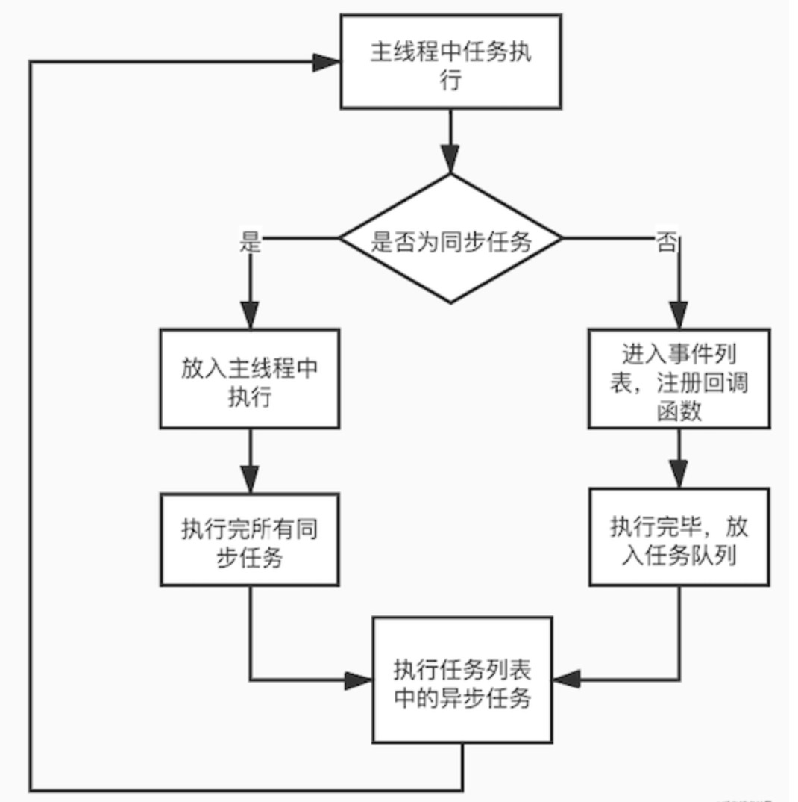

## 前言
我第一次接触到`EventLoop`的这个词的时候，还是在2年前的准备的实习面试，当时去应聘的第一家公司，面试官写了一大串`setTimeout`,`Promise`,`console.log`的代码来问我执行顺序，我当时人都是懵的，那时候的我还是只会用一堆`API`的小白，那次面试之后，我去网上看到了很多`EventLoop`的面试题，然后我就像是去背公式那样记下来`setTimeout`最后执行,`Promise`和`console.log`先执行，但是自己其实连`EventLoop`怎么来的都不知道，所以这样导致面试的时候有些问题稍微深挖一下就不知道，或者说自己在工作中真的遇到了这种问题也无从下手，`知其然也要知其所以然`，对此两年后的今天再详细的谈谈`EventLoop`是怎样的一个东西。

本文不会上来就丢出`EventLoop`的概念和题目！！！这样很没意思，文章不长慢慢看下去。

## 单线程的JS
大学期间大家基本都学习过`Java`，`Java`作为一门`多线程`的语言，`一个进程其可以创建多个不同的线程来执行不同的任务`，多个线程的好处大家基本都知道，当一个线程等待时其他的线程并不会跟着等待，就相当于高速公路有多个车道，并不会因为一台车故障了，所有的车全部动不了，这样的话也更好的`提高了CPU的利用率`。


这么一听好像挺不错的，那为啥我们的`JavaScript`确实单线程为啥不是多线程呢？难道就不怕我们的`JavaScript`代码执行的时候发生阻塞吗？

回答这个问题又要回到我们经典的DOM问题，如果JS是多线程，那一个线程需要操作一个DOM节点，而另一个线程要删除这个DOM节点那么该执行那个线程的任务呢？为了不让问题变得复杂，JavaScript从一开始就是单线程的。

当然后续HTML5的新特性中有web worker这个新特性允许JavaScript创建更多的线程，但是这些线程是`严格受到主线程的控制`并且`无法操作DOM元素`。

## 解决单线程的问题
既然JavaScript是单线程的，让人不禁的想到那是不是`很容易发生阻塞`？那处理耗时的任务（如Ajax请求和文件读写）岂不是会导致程序阻塞很长时间？那JS是怎么处理的呢？


```js
// 伪代码

console.log(a)
console.log(b)
ajax()
console.log(c)
```
如果上面的代码全是同步执行的，那么必定需要等待ajax()执行完毕才能打印c变量，但是c变量完全和ajax()完全无关,让ajax()占用我们的主线程属实有点浪费资源。为此`JavaScript的设计者`也意识到这个问题，那遇到这种费时的操作可以先挂起此任务，让后面的任务继续执行。为此JavaScript分为了`同步任务和异步任务`。

`同步任务`：同步任务很好理解，就是主线程按代码顺序执行，前一个任务执行完才执行下一个任务执行。

`异步任务`：异步任务则是不是在主线程中执行，而是当异步任务执行完毕之后会放一个回调函数到任务队列中去，待主线程执行完毕，主线程才会读取任务队列的任务开始执行。

主线程中的任务执行流程图可归纳为下：





既然了解了同步任务和异步任务的执行顺序，接下来我们下面的程序怎么运行：
```js
console.log(1)
setTimeout(()=>{
    console.log(2)
}, 0)
setTimeout(()=>{
    console.log(3)
}, 0)
console.log(4)
```
先执行同步任务`1->4`，异步任务加入`任务队列（先进先出）`中可得`2->3`，组合可得答案为`1->4->2->3`

当然现在基本面试题不可能考的这么简单，比如下面这题：
```js
console.log(1)
setTimeout(()=>{
    console.log(2)
}, 0)
new Promise((resolve)=>{
    console.log(3)
    resolve()
}).then(()=> {
    console.log(4)
})
console.log(5)
```
如果按上面规则来说我们得出的答案是`1->5->3->2->4`，但是运行发现我们的答案明显是错的，为此我们需要明确异步任务中的一个定义就是宏任务和微任务。

## EventLoop
什么是宏任务，什么是微任务呢？

`宏任务`：宏任务包括 script ， setTimeout ，setInterval ，`setImmediate（Node中才有）`，I/O ，UI rendering。

`微任务`：微任务包括 `process.nextTick（Node中才有）`，promise ，MutationObserver。

所以说我们的异步任务还细分为了宏任务和微任务，那他们的执行顺序是怎样的呢？

1）当主线程中的同步任务执行完之后，主线程会查看异步任务中微任务队列中是否有可执行的任务，同理一样是先进先执行（队列的执行顺序）。

2）微任务队列中的任务执行完毕后，主线程会检查宏任务队列中是否有可执行的任务，任务执行顺序同样是先进先执行。

3)执行完微任务和宏任务后表示本轮异步任务执行完毕。
上述的异步任务执行的过程会不断的循环♻️，这也就是我们总是说的`EventLoop(事件循环)`。

那么我们再看看我们做错的那道题：

```js
console.log(1)
setTimeout(()=>{
    console.log(2)
}, 0)
new Promise((resolve)=>{
    console.log(3)
    resolve()
}).then(()=> {
    console.log(4)
})
console.log(5)
```
现在来看是不是直接可以得出结果是`1->3->5->4->2`。

## EventLoop练习题

```js
// 练习1

console.log(1)

setTimeout(function() {
  console.log(2)
}, 0)

new Promise(resolve => {
  console.log(3)
  resolve()
})
.then(function() {
  console.log(4)
})
.then(function() {
  console.log(5)
})

console.log(6)

```
先分析一下，同步任务有`1,3,6`，则同步任务按顺序一个一个执行可得`1->3->6`，而微任务有`4，5`，按顺序放入微任务队列`4->5`，宏任务只有`2`放入宏任务队列，最终我们按照同步任务->微任务->宏任务的顺序可得答案为`1->3->6->4->5->2`。


```js
// 练习2

console.log(1);
setTimeout(function() {
    console.log(2);
    new Promise(function(resolve) {
        console.log(3);
        resolve();
    }).then(function() {
        console.log(4)
    })
    setTimeout(function(){
        console.log(5)
    })
})
new Promise(function(resolve) {
    console.log(6);
    resolve();
}).then(function() {
    console.log(7)
})
```
这题和上面分析步骤一样，答案为`1->6->7->2->3->4->5`


```js
// 练习3

console.log(1)

async function async1() {
    await async2()
    console.log(2)
}

async function async2() {
    console.log(3)
}

async1()

setTimeout(function() {
  new Promise(function(resolve) {
    console.log(4);
    resolve();
}).then(function() {
    console.log(5)
})
}, 0)

new Promise(function(resolve) {
    console.log(6);
    resolve();
}).then(function() {
    console.log(7)
}).then(function() {
    console.log(8)
})

```

答案是`1->3->6->2->7->8->4->5`，这题不知道你有没有点懵，这两个async的函数属实有点捣乱，那我们来理解一下async这一步转换一下：

```js
new Promise((resolve, reject) => {
    console.log(3)
    resolve()
}).then(() => {
    console.log(2)
})
```
这样的话`2`就被添加到了微任务的队列，而`2`由于先于`4,5,7,8`进入微任务队列所以先执行,而`4,5`属于宏任务里面执行的微任务，则最后才被添加到微任务队列中,所以微任务的顺序为`2->7->8->4->5`，同步任务的顺序为`1->3->6`，得最后答案`1->3->6->2->7->8->4->5`。

## 结语
其实只要理解了JS和EventLoop的任务运行机制，解EventLoop的题目基本就是`万变不离其宗`。

参考：

[JavaScript 运行机制详解：再谈Event Loop](http://www.ruanyifeng.com/blog/2014/10/event-loop.html)

[yck:前端面试之道](https://juejin.cn/book/6844733763675488269/section/6844733763763568654)

