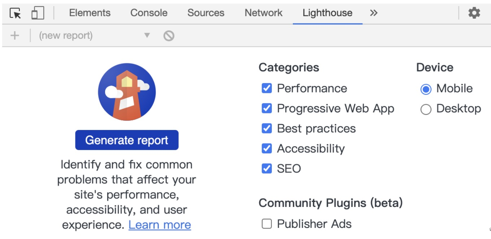
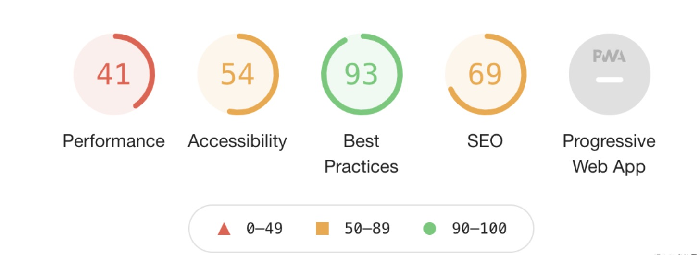
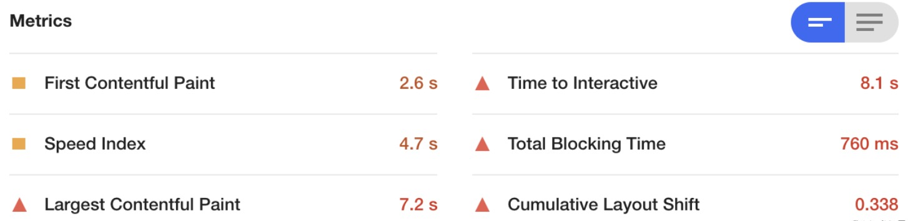
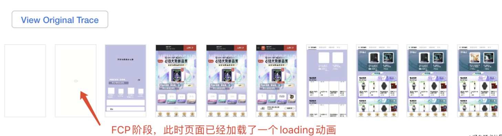
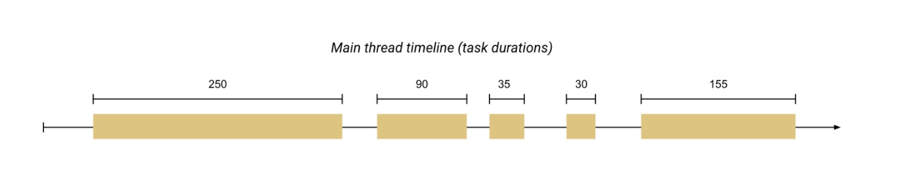
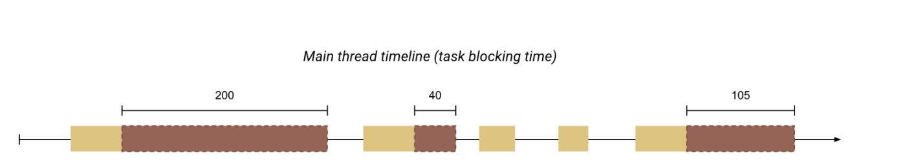

## 前言
在写这篇文章的时候，之前有看过一大堆性能优化的文章，对的，每次看到别人写的好的博客最终的归宿不是脑子🧠，而是收藏夹📖，也就导致于当我真正遇到性能问题的时候束手无策，我也真是理解了那句话`纸上得来终觉浅，绝知此事要躬行`。今天在跟测的时候，测试大哥就一直在吐槽，为什么你这新页面白屏这么的久，图片这里渲染的这么的慢，为什么感觉这动画一卡一卡的......真的那一刻我快被问成了十万个为什么了，这时我打开了尘封已久的收藏夹阅读了起来......

## 走进Lighthouse
根据我的收藏夹中的文章显示，我的谷歌浏览器就能进行H5页面性能的分析，我可真是太开心了，我就喜欢这种0配置0代码的傻瓜教程。
> 版本高的Google浏览器自带了lighthouse，无需进行其他的操作

`Categoies（分类）`里面包括了`Performance（性能）`,`PWA`,`Best practices(最佳实践)`,`Accessibility(可访问性)`,`SEO(搜索引擎优化)`。

`Device(设备)`也可以选择是`Mobile(手机)`,`Desktop(桌面端设备)`。

既然我们是H5页面，那选择好`Mobile`,分类我们`没有使用PWA技术`，那么我们除了PWA之外全部勾选,最后点击`Generate report`生成最终的报告。

## 性能指标分析
这便是我们网页最终的报告，下图是各项指标的分数，下面根据更具体一些时间指标来衡量我们的性能。

真的是只能淡淡说一句时代变了，原来衡量性能好坏有以下6个方面，我记得之前衡量一个页面的性能当初张口闭口就是白屏多少秒😂

### FCP
`FCP(Fisrt Contentful Paint)`：这个指标用于记录页面首次绘制文本、图片、非空白 Canvas 或 SVG 的时间。

举个例子说说，就是页面从白屏到出现出现一张图片或者一段文字的时间，当然其实很多时候页面要去请求接口拉取数据，如果网络比较慢的话肯定会白屏比较久，那么我们的其实可以在数据没加载前`放一个loading的图片`,告诉用户页面在加载中,从而`减少我们的FCP的时间`。

### TTI
`TTI(Time to Interactive)`：这个表示首次可交互可流畅的交互时间，这个时间有几个特点：`位于FCP之后`,`并且5秒内无长任务(大于50ms)的执行`。

其实这个指标和FCP一样都很重要，FCP可能意味着我们的页面开始渲染，即使渲染出页面不代表可以交互了，很多的时候我们的页面渲染出来了，但是会比较的卡顿。

### Speed Index
速度指数衡量的是内容在页面加载过程中的视觉显示速度。Lighthouse首先会在浏览器中捕获一段页面加载的视频，并计算出各帧之间的视觉进度。

### TBT
`TBT(Total Blocking Time)`：表示从FCP到TTI阶段中长任务总阻塞时间。

以下为web.dev官网对TBT所书写的例子：

上图表示主线程所做的任务时间线，其中任务分为长任务和短任务（长短任务的依据为执行时间是否大于50ms）。

那么超过50ms的地方实际上就是阻塞时间，那上面实际上阻塞时间就是345ms。当然阻塞导致浏览器无法中断正在进行的任务，从而使得用户无法立即进行交互，从而影响体验。

### LCP
`LCP(Largest Contentful Paint)`:表示页面最大的内容绘制。该时间会随着页面渲染变化而变化，因为页面中的最大元素在渲染过程中可能会发生改变，另外该指标会在用户第一次交互后停止记录。

### CLS
`CLS(Cumulative Layout Shift)`：表示页面累计位移偏移。页面内容的意外移动通常是由于异步加载资源或将DOM元素动态添加到现有内容上方的页面而发生的。

如果用户在使用页面的过程中点击一个按钮，然后页面生成一块内容，导致该内容下面的所有内容下移，这便是一次页面的位移。

## lighthouse的修改建议
`lighthouse的优点`不仅仅可以根据这些重要的指标给我们的页面打分，更重要的是lighthouse会给我们很多的优化建议，这就相当于老师既会给学生打分又会讲解错题，真是很爽，不然的话还得去网上一个一个自己找解决方法，而且很多时候自己还没有解决的方向。

- 下面是lighthouse给我们的一些**建议**

- 下面是有关我们的项目对性能的**诊断结果**

后续的话进行项目性能优化的详细实践。

